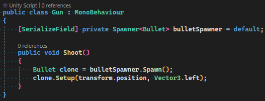
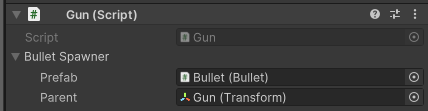
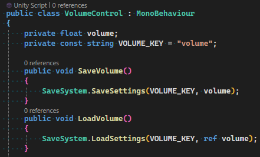
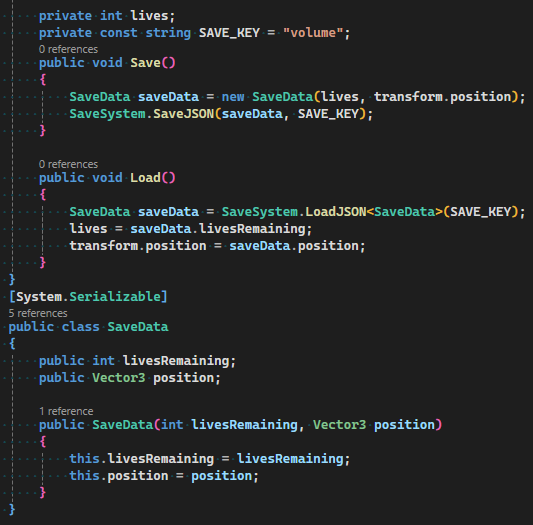

## 🚀 Feature Overview

<h3>
    Spawners
</h3>

> Spawners simplify the Instantiation of Components. They also use <i>object pooling</i> for efficiency.

**Spawner**
- Easiest to implement

**SpawnableSpawner**
- Most efficient, but requires the spawning object to inherit **ISpawnable** or **Spawnable**

**MultiSpawner**
- Can spawn objects of different types. Prefab needs to be provided in the **Spawn()** method

<h3>
    SaveSystem
</h3>

> Allows you to save anything as JSON or XML file in the Documents folder of the user

Quickly save and load a single value (bool, int, float).

Save and load a **Serialized Class**

<h3>
    And more!
</h3>

- Useful [Extensions](Runtime/Extensions.cs)
- <i> more to be documented soon</i>
